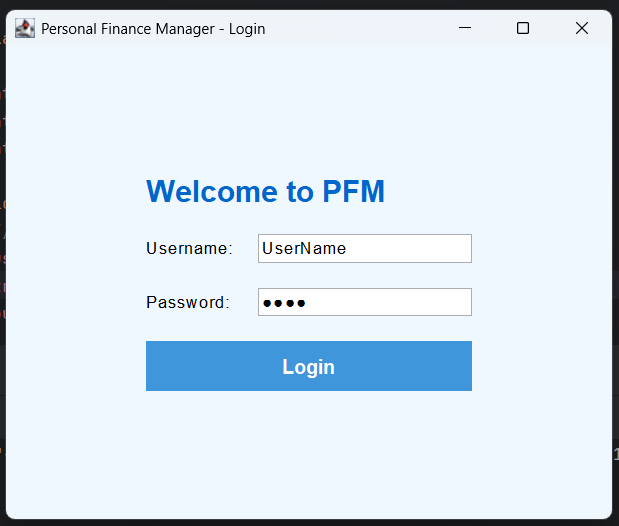
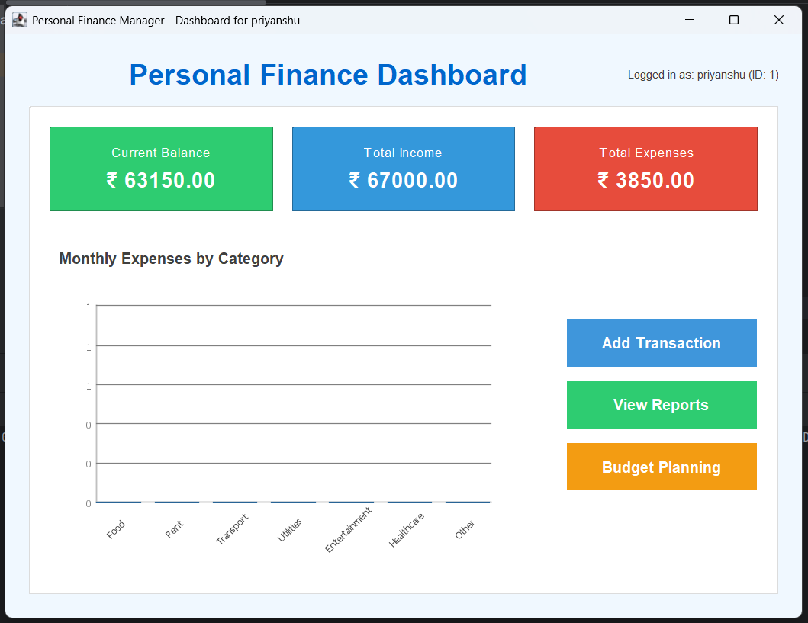
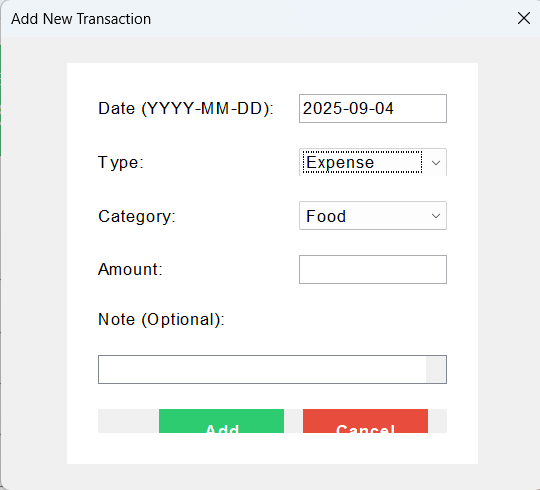
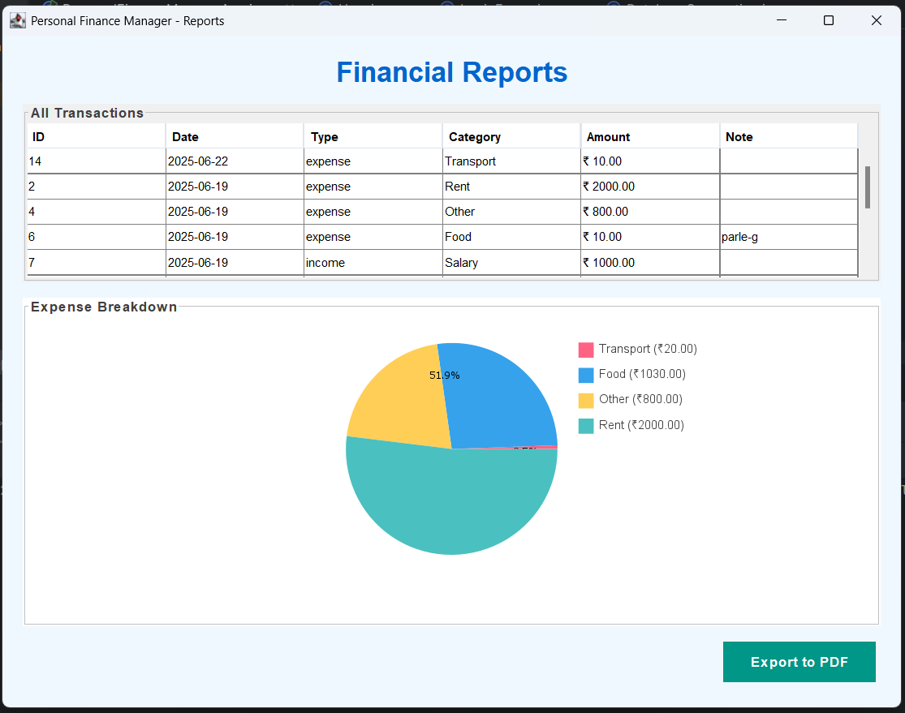

# Personal Finance Manager – Java Swing

A **desktop application built with Java Swing** that helps users manage their personal finances. It allows tracking of income, expenses, and savings with a simple graphical interface. The project demonstrates **Object-Oriented Programming concepts**, **Java Swing GUI design**, and **basic financial management features**.

---

## 🚀 Features
- **User-friendly GUI** using Java Swing  
- Add, edit, and delete income and expense transactions.
- Categorize transactions (e.g., Food, Travel, Bills, Salary)  
- View summary reports of income vs. expenses  
- Simple budget tracking 
- Lightweight and easy to run  

---

## 🛠️ Technologies Used
- Java (JDK 8+) 
- Java Swing (for GUI)  
- Collections Framework (for managing transactions)  
- File I/O 

---

## 📂 Project Structure
```
src/
└── pack_Project/
    ├── Main.java               # Entry point of the application
    ├── LoginFrame.java         # Login screen
    ├── Dashboard.java          # Main dashboard UI
    ├── Transaction.java        # Model class for financial transactions
    ├── TransactionManager.java # Handles logic for adding/removing transactions
    ├── ReportFrame.java        # Generates summary reports
    └── ... (other files)
```


## ▶️ How to Run
1. **Clone the repository**
   ```bash
   git clone https://github.com/priyanshu052004/PersonalFinanceManager-JavaSwing.git
   cd PersonalFinanceManager-JavaSwing/src
   ```

2. **Run the application**
   ```bash
   java pack_Project.Main
   ```

---

## 📸 Screenshots 

Here are some screenshots showcasing the UI of the application:

| Screen                | Preview |
|----------------------|---------|
| Login Screen         |  |
| Dashboard            |  |
| Add Transaction Form |  |
| Report View          |  |


Example:
- Login screen  
- Dashboard  
- Add transaction form  
- Report view  

---


